# Project Title
自然场景渲染

# Team member

| 学号    | 姓名   |
| ------- | ------ |
| 1950483 | 謝子康 |
| 1950638 | 陈冠忠 |
| 1951042 | 王远洋 |
| 1951125 | 农烨   |
| 1952217 | 孙泽凯 |
| 1952704 | 王麒斌 |

# Motivation

计算机图形学在众多领域有广泛的应用。其中，室外场景渲染是图形学重要的研究课题，也是3D图形引擎的核心。本小组紧扣课程所教内容，尝试充分运用渲染知识，针对一个较为复杂的场景，进行真实美观的渲染。

场景的选择中，自然场景较社会场景具有普遍性，因此成为本组的项目目标。自动场景纷繁复杂，水体、光照、云、树木等物体颇多。本组尝试对其部分景物实现建模与渲染。

# The Goal of the project

1. 导入复杂的露天场景，包含水面、动态光源、物理天空；
2. 实现PBR渲染流程与延迟渲染；
3. 实现动态水面渲染；
4. 采用多种程序方式增强画面表现力，包括HDR、Bloom、SSAO、FXAA等；
5. 采用多种美术方式增强画面表现力，如烘焙法线贴图、PBR贴图；
6. 采用基于Ray-marching的体积渲染，实现体积光、体积云等效果。

# The Scope of the project

1. 包含粒子系统的环境，包含火焰、雪等；
2. 更加复杂的PBR效果，如IBL等;
3. 水面的反射折射效果；
4. 更多增强画面表现力的方式，如镜头光晕；
5. 阴影实现部分尝试使用VSM等更高效的软阴影。

# Involved CG techniques


1. 延迟渲染 + SSAO
    为了实现更好的模型加载效果，尤其是对于模型褶皱、孔洞和非常靠近的墙面变暗的方法近似模拟出间接光照，引入了屏幕空间环境光遮蔽（SSAO）技术。由于SSAO与延迟渲染完美兼容，因此，在延迟着色的基础之上引入SSAO技术。通过G缓冲获取几何体的信息，通过法向半球以及随机核心转动的采样计算SSAO，并且添加环境遮蔽模糊为呈现更好的视觉效果，以此实现SSAO效果。

2. 体积光
    模拟自然环境，体积光自然是必不可少的效果。自然场景中的烟、雾、光、云等产生的效果可以通过图形学的方式来实现。体积光的实现采用着色器绘制的方式，即在着色器中计算体积光的光路效果。本次使用的是Ray-Match的方式来实现体积光，通过采样步长来计算效果。为了模拟太阳光这样的光源的效果，加入大气散射的效果，即Mie散射，计算的公式如下：
    $$
    f_{HG}(\theta)=\frac{(1-g)^2}{4\pi (1+g^2-2g\cdot cos(\theta))^{3/2}}
    $$

3. PBR渲染
    PBR基于物理的渲染采用粗糙度与金属度作为输入，使用更复杂的BRDF模型，能够提供更为真实的光照效果。程序采用经典的Cook-Torrance反射率方程实现PBR，并支持导入由Bitmap2Material软件生成的粗糙度贴图提供更加精细的粗糙度输入。

4. 阴影
    程序使用shadow mapping技术实现阴影，包含了基本的定向光阴影和基于立方体贴图的点光源阴影，并使用PCF实现软阴影。

5. 后处理效果
    使用多种后处理效果提升画面表现力：
    
    (1) HDR：主渲染阶段在高动态范围内完成，在后期处理阶段中，使用Reinhard色调映射映射回低动态范围，从而保留更多的明暗信息。
    
    (2) 辉光：在HDR技术的基础上，在主渲染阶段保存渲染结果中高亮度的部分，经过多次两步高斯模糊后，在后期处理阶段中与原渲染结果混合。程序采用双线性纹理的方式加速高斯模糊，并可在后期处理着色器中通过设定系数的方式调整两种不同效果的混合方式的强度，来调整辉光的具体效果。
    
    (3) FXAA：受制于延迟渲染的特性，无法使用MSAA完成抗锯齿工作，因此采用基于后处理的FXAA技术完成抗锯齿。FXAA通过NVIDIA提供的公式工作，原理是在渲染完成后的屏幕图像中，通过像素颜色检测边缘，并由此完成不同程度的模糊完成抗锯齿。
    
    (4) 景深：主流渲染软件均提供景深效果用于模拟摄像机焦距以强调目标，本程序同样设计了简单的景深流程以削弱天空背景与场景间的对立感。在主渲染阶段中将片段(像素)的相机坐标系深度通过a通道传递到后期处理阶段。在后期处理阶段，根据a通道的值，对不同深度的像素进行不同范围的简单线性平均，并通过简单深度差值过滤的方式防止不同深度的物体颜色出现混合。为提高速度，根据实际渲染需要，景深与FXAA不同时进行。
    
6. 水体渲染

    在水体渲染中，最核心的部分为波形的模拟技术，即如何模拟出逼真的水面波浪的流动变化。本项目中采用基于快速傅立叶变换的水体渲染方法，其特点是真实感出色、全局可控、细节丰富，但计算量较大。在水体着色方面，主要采用了寒霜引擎提出基于快速次表面散射近似方法。
    
7. 物理天空

	关于物理天空的内容，将会在Implementation模块详细论述，此处不赘述。

# Project contents

本项目使用图形学知识模拟了一个自然场景，结合了建筑模型，欲构建古典风格——”近水楼台“，具体内容如下：

1. 白昼更替，日月交换，太阳和月亮交替，二者跟随时间变换，对场景产生影响。
2. 古风建筑模型以及自然场景，跟随自然光照的变化而产生诸如阴影、体积光等变化效果。
3. 物理天空穹顶变换，体积云随着时间发生变换，并且云层会产生流动效果。
4. 波动的水面，模拟自然的水面跟随光照的变化而变换。

# Implementation

## 物理天空
#### 1. 球体绘制以及重要参数

SkyDome和传统SkyBox不同的是，SkyDome使用一个球体来渲染天空，因此能实现太阳月亮的位置随时间变化。重要参数包括天气weather（决定云层厚度）、当前时间（决定天空底色）以及太阳位置（用于绘制太阳和月亮）

#### 2. 天空底色

天空底色是根据太阳高度和片元与太阳的距离来读取材质，太阳高度越高、离太阳越近，天空的底色就越明亮。同时在日出日落时，会将太阳周围的区域渲染成橘黄色，从而实现较好的日出日落效果

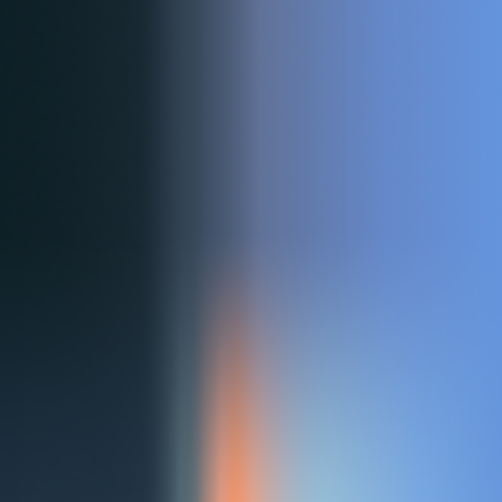

#### 3. 云层

读取厚薄两种云层，根据天气变量weather对两者进行混合

```glsl
float transparency = mix(texture(clouds2,vec2(u,v)).r,texture(clouds1,vec2(u,v)).r,(weather-0.5)*2.0);
```

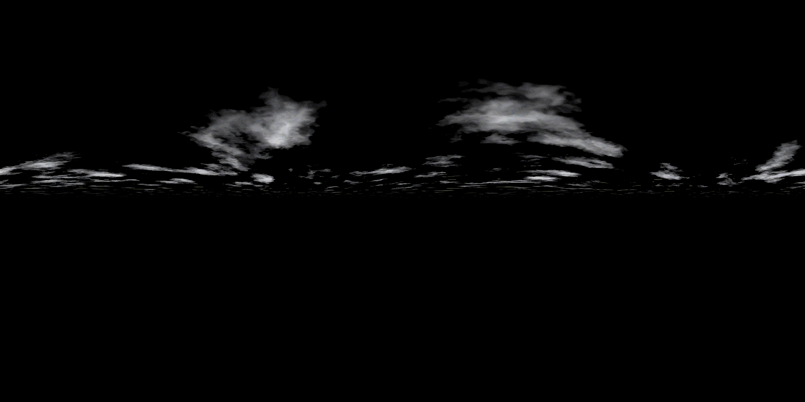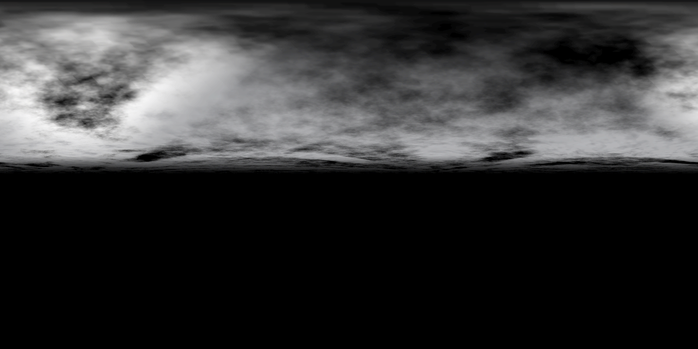

#### 4. 星空

星空只在傍晚或者夜晚渲染。首先通过噪音产生随机数，当随机数大于设定的阈值时，该处为星星。

#### 5. 渲染太阳月亮

太阳和月亮的渲染流程有些许不同，因为太阳是没有具体的细节的，而月亮有陨石坑等细节，因此使用两个类型的材质。太阳的贴图是一张以片元到太阳距离dist为横轴的四通道贴图（如左下所示），第四通道为透明度，保障了太阳不会出现黑边的问题。月亮是一张普通的黑底图片（如右下所示），但是想要在球面上渲染平面图片而不发生畸变，需要将位置向量投影到虚构一个平面，以此为坐标来获取材质。

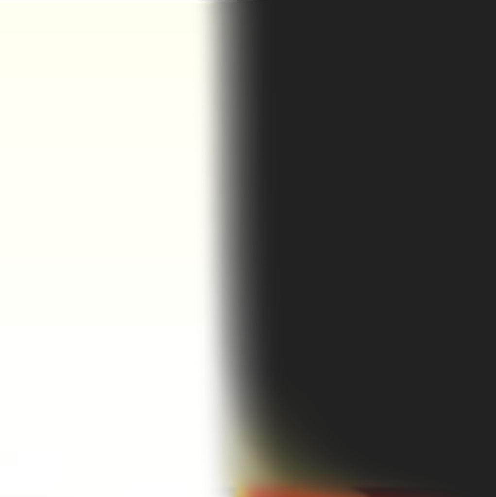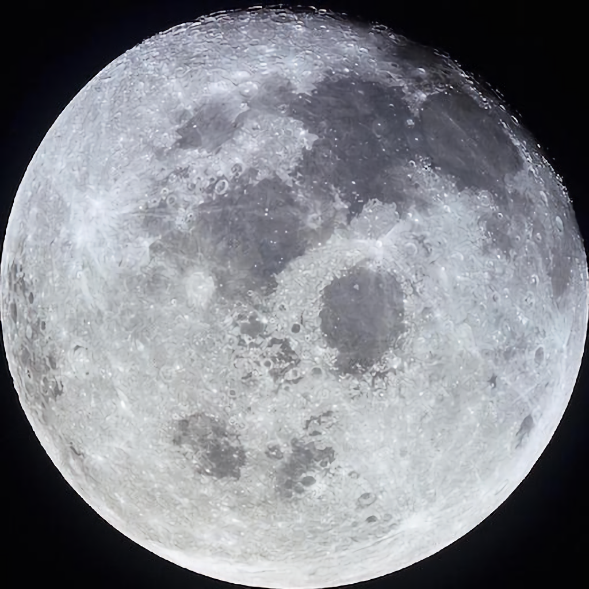

#### 6. 最终混合

将上述步骤的结果进行组合便能得到SkyDome，效果如下，但是该方法实现的物理天空仍有缺陷。

最主要的缺陷便是云层不够真实，首先，云层过远导致真实感不强，没有飘在头顶的感觉；其次，云朵没有立体感，给人的感觉是片状的；最后，云朵的运动路径为沿着球面移动，因此会有云朵是绕着一根轴转的感觉。

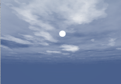 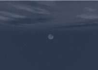

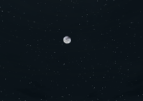

### 体积云

为了增加云的真实性，决定实现体积云。云彩具有不规则，无实体的特性，故引入了基于Ray Marching的体积云。

Ray Marching算法在渲染片元时，发出一条由摄像机到片元的射线，判断是否与云彩相交，若相交，则累计密度。最后根据累计密度将云层和片元颜色混合。

```glsl
for(int i=0; i<100; i++) {
    point += step;
    cloudColor = getCloud(FragPos);   	//获取云朵的颜色   
    colorSum = colorSum + cloudColor * (1.0 - colorSum.a);   // 与累积的颜色混合
}
```

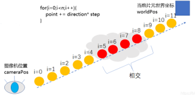 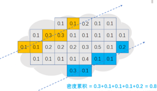

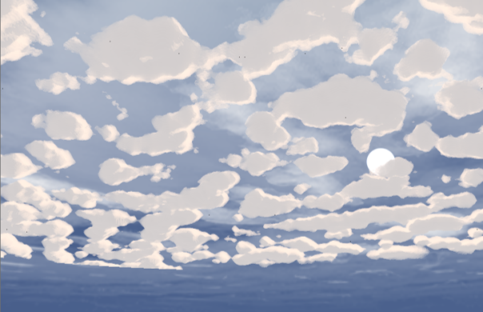

#### 优化

可以看到初版体积云不够真实，原因如下：

1、对噪声进行截断，导致云彩边缘过于锋利

2、噪声频率单一，云层密度较为均匀

3、云层不透明度较大

对此我们进行了以下优化：

1、将噪声源通过变频叠加的方法形成复合噪声，使得噪声更加平滑

2、对噪音进行截断后，将其均匀分布在0~1之间

3、根据时间和天气对云层透明度进行更改

进行优化的关键便是引入了复合噪声。复合噪声将噪声源的频率分别变为原来的2、4、8、16得到新噪声，再将这些新噪声按一定比例与原噪声进行叠加便得到了复合噪声。得到的效果如下所示，可以说是比较令人满意的。

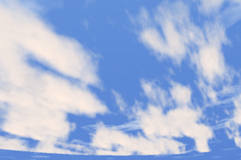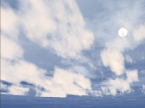

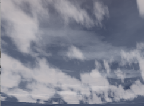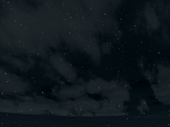

## 体积光
体积光的原理已经在上面分析，下面是核心实现代码，如下：


## 水体渲染

### 1.波形模拟

如果将开放海域的波浪高度看作定义在XZ平面上的空域信号 ![[公式]](https://www.zhihu.com/equation?tex=h%28x%2Cz%29) ，根据经验，这个信号天然地就很接近大量正弦信号的叠加。如果我们知道了其频谱 ![[公式]](https://www.zhihu.com/equation?tex=%5Ctilde%7Bh%7D%28%5Comega_%7Bx%7D%2C%5Comega_%7Bz%7D%29) ，则使用傅里叶逆变换，就可以求出 ![[公式]](https://www.zhihu.com/equation?tex=h%28x%2Cz%29) ，即得到海面的高度场。

由于计算机不能处理连续或无限的事物，所以海面模拟里用的傅里叶逆变换是离散傅里叶逆变换(Inverse Discrete Fourier Transform(IDFT))。

海面高度由下面IDFT给出：

![[公式]](https://www.zhihu.com/equation?tex=h%28%5Cvec%7Bx%7D%2Ct%29%3D%5Csum_%7B%5Cvec%7Bk%7D%7D%5E%7B%7D%7B%5Ctilde%7Bh%7D%28%5Cvec%7Bk%7D%2Ct%29e%5E%7Bi%5Cvec%7Bk%7D%5Ccdot%5Cvec%7Bx%7D%7D%7D)

其中：

![[公式]](https://www.zhihu.com/equation?tex=%5Cvec%7Bx%7D%3D%28x%2Cz%29) 为空域坐标。![[公式]](https://www.zhihu.com/equation?tex=%5Cvec%7Bk%7D%3D%28k_%7Bx%7D%2Ck_%7Bz%7D%29) 为频域坐标。kx,kz均为频率，相当于前文中的 ![[公式]](https://www.zhihu.com/equation?tex=%5Comega_%7Bx%7D) 和 ![[公式]](https://www.zhihu.com/equation?tex=%5Comega_%7Bz%7D) 。![[公式]](https://www.zhihu.com/equation?tex=%5Ctilde%7Bh%7D%28%5Cvec%7Bk%7D%2Ct%29) 为频谱。这里频谱 ![[公式]](https://www.zhihu.com/equation?tex=%5Ctilde%7Bh%7D%28%5Cvec%7Bk%7D%2Ct%29)较前文多了个参数t，表示此频谱会随时间变化，相应地高度函数![[公式]](https://www.zhihu.com/equation?tex=h%28%5Cvec%7Bx%7D%2Ct%29)就也变成随时间变化的了，所以也加参数t。另外注意![[公式]](https://www.zhihu.com/equation?tex=e%5E%7Bi%5Cvec%7Bk%7D%5Ccdot+%5Cvec%7Bx%7D%7D) 中![[公式]](https://www.zhihu.com/equation?tex=%5Cvec%7Bk%7D)与![[公式]](https://www.zhihu.com/equation?tex=%5Cvec%7Bx%7D)是点乘，即 ![[公式]](https://www.zhihu.com/equation?tex=e%5E%7Bi%28k_%7Bx%7Dx%2Bk_%7Bz%7Dz%29%7D) ，表示：固定z，只让x变化时频率为 ![[公式]](https://www.zhihu.com/equation?tex=k_%7Bx%7D) ；固定x，只让z变化时频率为 ![[公式]](https://www.zhihu.com/equation?tex=k_%7Bz%7D) 。求和是对所有频域坐标点![[公式]](https://www.zhihu.com/equation?tex=%5Cvec%7Bk%7D) 进行。

基于海洋统计学，频谱![[公式]](https://www.zhihu.com/equation?tex=%5Ctilde%7Bh%7D%28%5Cvec%7Bk%7D%2Ct%29)通常采用的是菲利普频谱，公式如下：

![[公式]](https://www.zhihu.com/equation?tex=%5Ctilde%7Bh%7D%28%5Cvec%7Bk%7D%2Ct%29%3D%5Ctilde%7Bh%7D_%7B0%7D%28%5Cvec%7Bk%7D%29e%5E%7Bi%5Comega%28k%29t%7D%2B%5Ctilde%7Bh%7D_%7B0%7D%5E%2A%28-%5Cvec%7Bk%7D%29e%5E%7B-i%5Comega%28k%29t%7D)

其中， ![[公式]](https://www.zhihu.com/equation?tex=%5Ctilde%7Bh%7D_%7B0%7D%5E%2A) 表示 ![[公式]](https://www.zhihu.com/equation?tex=%5Ctilde%7Bh%7D_%7B0%7D) 的共轭复数，k表示 ![[公式]](https://www.zhihu.com/equation?tex=%5Cvec%7Bk%7D) 的模。

![[公式]](https://www.zhihu.com/equation?tex=%5Comega%28k%29%3D%5Csqrt%7Bgk%7D)

其中g为重力加速度。


![[公式]](https://www.zhihu.com/equation?tex=%5Ctilde%7Bh%7D_%7B0%7D%28%5Cvec%7Bk%7D%29%3D%5Cfrac%7B1%7D%7B%5Csqrt%7B2%7D%7D%28%5Cxi_%7Br%7D%2Bi%5Cxi_%7Bi%7D%29%5Csqrt%7BP_%7Bh%7D%28%5Cvec%7Bk%7D%29%7D)

其中 ![[公式]](https://www.zhihu.com/equation?tex=%5Cxi_%7Br%7D) 和 ![[公式]](https://www.zhihu.com/equation?tex=%5Cxi_%7Bi%7D) 是相互独立的随机数，均服从均值为0，标准差为1的正态分布。

![[公式]](https://www.zhihu.com/equation?tex=P_%7Bh%7D%28%5Cvec%7Bk%7D%29%3DA%5Cfrac%7Be%5E%7B-1%2F%28kL%29%5E2%7D%7D%7Bk%5E4%7D%7C%5Cvec%7Bk%7D%5Ccdot%5Cvec%7Bw%7D%7C%5E2)

其中，w是风向。L定义见如下。

![[公式]](https://www.zhihu.com/equation?tex=L%3D%5Cfrac%7BV%5E2%7D%7Bg%7D)

其中V为风速。

### 2.水体着色

在着色部分，除了模拟自然的水面跟随光照的变化而变换外，重要的是对次表面散射的模拟，使得海洋通透起来，显得更有真实感。

对此主要采用了寒霜引擎于GDC2011提出的基于快速次表面散射近似方法(Fast SSS)。

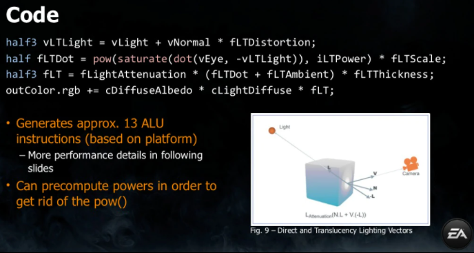

对其稍作改动，得到如下代码:

```glsl
float SSScolor(vec3 lightDir,vec3 viewDir,vec3 normal,float Distortion,float waveHeight,float SSSMask)
{
    vec3 vLTLight = normalize (-lightDir + normal *Distortion);
    float I = pow(saturate(dot(viewDir,-vLTLight)),power)*SSSMask*waveHeight;

    return I*LightColor;
}
```

----

# Result

下面为场景的演示部分，具体可以观看视频查看最终展示效果：

1. 下图展示了强烈的体积光效果：

</img>


2. 下为模型的俯瞰图：


3. 下图较为全面展示了效果，建筑、自然场景、明月、物理天空、水面以及明显的体积光效果:


4. 物理天空特写，如下：


----

# Roles in group
**謝子康**：负责法线贴图的生成与导入(包含导入代码与DEBUG)，对模型的调整与导入，粗糙度贴图的制作与调整及部分参数调整。

**陈冠忠**：物理天空的绘制，天空穹顶的生成、云层、星空以及体积云的相关工作。

**王远洋**：负责延迟渲染、屏幕空间环境光遮蔽以及体积光的效果实现，部分封装与设计，体积光与物理天空模块的修复、合成，以及仓库的部分管理工作。

**农烨**：负责包含HDR、辉光、FXAA、景深在内的后期效果实现，PPT制作与部分合并工作。

**孙泽凯**：负责PBR渲染主流程设计，阴影相关功能的代码设计、封装与调整，包含HDR、辉光在内的后期效果实现，模型的寻找与初步导入，粗糙度贴图导入代码，并完成了大部分模块合并与DEBUG调优工作。

**王麒斌**：负责水体部分的模拟与渲染，包括水体波形模拟与水面着色相关的工作。

# References
[1] [learnopengl](https://learnopengl.com/)

[2] [volume light rendering](https://stackoverflow.com/questions/65784612/volumetric-light-not-rendering-volume-correctly)

[3] [体积光效果实现](https://blog.csdn.net/ZJU_fish1996/article/details/87533029)

[4] [真实感水体渲染技术](https://zhuanlan.zhihu.com/p/95917609)

[5] [Fast SSS](https://colinbarrebrisebois.com/2011/03/07/gdc-2011-approximating-translucency-for-a-fast-cheap-and-convincing-subsurface-scattering-look/)

[6] [fft海面模拟]([fft海面模拟(一) - 知乎 (zhihu.com)](https://zhuanlan.zhihu.com/p/64414956))

[7] [FFT海洋水体渲染学习笔记](https://zhuanlan.zhihu.com/p/335946333)
